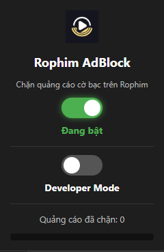

# 📌 Rophim AdBlock – Chặn Quảng Cáo Cờ Bạc trên Rophim

## 📖 Giới thiệu

**Rophim AdBlock** là tiện ích mở rộng trình duyệt giúp **tự động chặn toàn bộ quảng cáo cờ bạc** trên trang [Rophim](https://rophim.me) và các domain liên quan như:

- `finallygotthexds.site`  
- Tất cả **subdomain** của `finallygotthexds.site`  

Tiện ích **không chặn toàn bộ trang Rophim** mà chỉ **loại bỏ các phần tử iframe, div, script… chứa quảng cáo cờ bạc**, giúp bạn xem phim **nhanh hơn, sạch sẽ hơn, không bị pop-up làm phiền**.

Ngoài ra, Rophim AdBlock còn có:
- **Developer Mode**: Giám sát tài nguyên mà trang web tải, hỗ trợ debug/tracking.
- **Bộ đếm số quảng cáo đã chặn**.
- **Giao diện bật/tắt tiện ích nhanh** ngay trong popup.

---

## ✨ Tính năng chính

- 🚫 Chặn toàn bộ request đến `*.finallygotthexds.site`
- 🧹 Xóa các phần tử DOM chứa nội dung từ domain này (iframe, div, script…)
- 🔄 Cập nhật liên tục khi trang load thêm nội dung mới (MutationObserver)
- 🛠 Developer Mode: Hiển thị log tài nguyên bị chặn
- 📊 Đếm số lượng quảng cáo đã chặn
- 🎛 Nút bật/tắt AdBlock ngay trên popup

---

## 🛠 Hướng dẫn cài đặt

### Cài đặt qua **Developer Mode**

#### Trên **Chrome**:
1. Tải source code extension về máy (`RophimAdBlock.zip` hoặc clone từ GitHub).
2. Giải nén file `.zip` thành thư mục.
3. Mở **Chrome** → vào `chrome://extensions`.
4. Bật **Developer mode** (chế độ nhà phát triển).
5. Nhấn **Load unpacked** → chọn thư mục vừa giải nén.
6. Extension sẽ xuất hiện ở thanh công cụ, bấm vào icon để mở popup.

#### Trên **Microsoft Edge**:
1. Mở **Edge** → vào `edge://extensions`.
2. Bật **Chế độ nhà phát triển** (Developer mode).
3. Nhấn **Tải tiện ích đã giải nén** → chọn thư mục vừa giải nén.
4. Icon tiện ích sẽ xuất hiện, bấm vào để sử dụng.

---

## 📷 Giao diện

**Popup tiện ích:**

---

## 📜 Quyền sử dụng

Tiện ích này chỉ sử dụng quyền:
- `declarativeNetRequest`: Chặn request đến domain quảng cáo.
- `storage`: Lưu trạng thái bật/tắt, log, bộ đếm.
- `host_permissions`: Chỉ áp dụng cho `rophim.me` và `*.finallygotthexds.site`.

❗ **Không thu thập bất kỳ thông tin cá nhân nào** của người dùng.

---

## 📄 Giấy phép

MIT License © 2025
